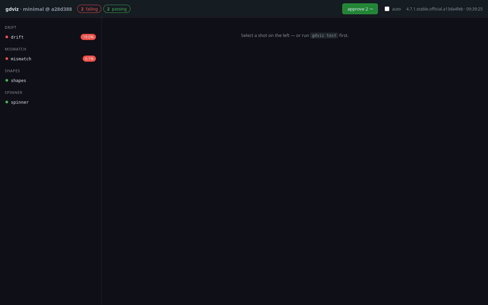
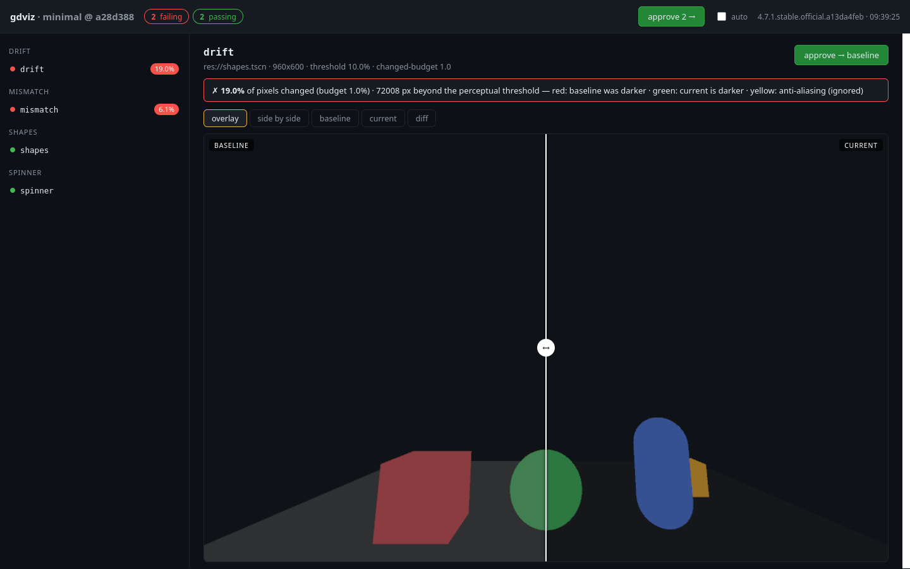
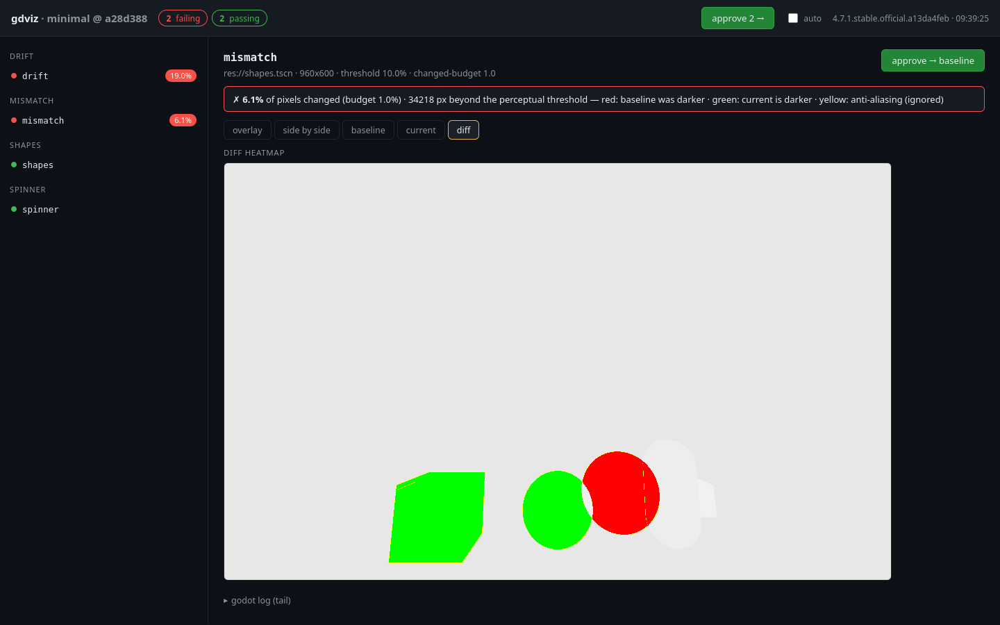
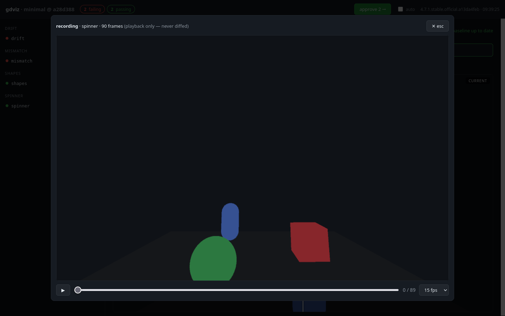

# omniviz

**Visual regression testing for Godot — with a review UI, approvals, and recordings.**

omniviz brings the webdev workflow (Chromatic, Percy, Playwright screenshots) to Godot:
render a scene deterministically, screenshot it, pixel-diff it against a committed
baseline, and review the diffs in a local UI where approving a change promotes it
to the new baseline. Scenarios can also record themselves so you can watch what
actually played out — recordings are never diffed and never committed.

One static binary. No pip, no node, no runtime dependencies — the review UI is
embedded (htmx 4).

```
omniviz test     →  capture every shot, diff vs baselines, non-zero exit on regressions
omniviz review    →  http://127.0.0.1:8420  — diffs, overlay slider, recordings, approvals
omniviz approve  →  promote a changed image to the new baseline
```

## What it looks like

The shot list — status chips up top, failing shots with change badges:



**Drift** — a global brightness/fog shift moves every pixel a little. The
per-pixel threshold rightly tolerates small shifts, so the **changed-area
budget** fails the shot instead, and the overlay slider wipes
baseline↔current:



**Mismatch** — a structural change (a box removed, an object moved) lights up
the diff heatmap: red where the baseline was darker, green where the current
is darker, yellow for ignored anti-aliasing:



**Recordings** — shots can record the whole scenario; a frame-scrubber player
opens right in the UI (play/pause, arrow keys, fps selector):



## A runnable example

[`examples/minimal`](examples/minimal) is a tiny Godot project ( coloured
primitives, no gameplay) with four shots: `shapes` and `spinner` pass;
`drift` (everything brightened) and `mismatch` (a box hidden, a ball moved)
ship failing **on purpose** so you can explore the failure UI immediately.

```bash
git clone https://github.com/jshthornton/omni-viz && cd omniviz
mise run build
bin/omniviz test --project examples/minimal      # PASS 2 · FAIL 2 (by design)
bin/omniviz review --project examples/minimal    # open the UI, click around
bin/omniviz approve --project examples/minimal drift mismatch   # go all-green
```

## Why

Godot has unit test frameworks (GUT, gdUnit4), but games are visual: layout
regressions, material drift, generation changes and authored-scene mistakes are
invisible to `assert_eq`. omniviz makes every screenshot a reviewable, committed
artifact — intended changes get approved and become the new reference,
unintended ones fail the run with a pixel heatmap of exactly what moved.

## Install

```bash
go install github.com/jshthornton/omni-viz@latest
```

or build from a clone (mise users: `mise run build`, others: `go build -o bin/omniviz .`).

Requirements: a machine with a GPU/display that can run Godot graphically
(Forward+/Vulkan on Linux; a small X11 window is spawned, unfocused). Headless
servers without a GPU cannot render, so they cannot capture.

## Quickstart

Add a `omniviz.toml` to your Godot project root:

```toml
baseline_dir = "tests/visual/baselines"   # committed to git
output_dir = "tmp/omniviz"                  # gitignored: currents, diffs, recordings, report

[render]
width = 1280
height = 720

[[shot]]
name = "main-menu"
scene = "res://scenes/main_menu.tscn"
quit_after = 120                # generic mode: render 120 frames, last frame is the shot

[[shot]]
name = "gameplay"
scene = "res://tests/visual/gameplay.tscn"   # your scene: it screenshots itself and quits
paths = ["tmp/visual_tests/gameplay/*.png"]  # globs (relative to project) collected as shots
threshold = 0.05
```

```bash
omniviz test               # 1st run: everything is NEW — nothing has a baseline yet
omniviz review             # inspect the shots; click approve to adopt them
omniviz approve --all      # or adopt from the CLI
omniviz test               # now: PASS — and every future run diffs against these
```

Commit `baseline_dir/` (the reference images). Never commit `output_dir/`.

### Two ways a shot is captured

- **Generic mode** (`quit_after`, no `paths`): omniviz runs the scene under Godot's
  movie-writer (deterministic fixed-fps frames) and uses the final recorded frame
  as the screenshot. Zero project code — point it at any scene.
- **Cooperative mode** (`paths`): your capture scene runs its scenario, saves PNGs
  wherever it likes, and quits. omniviz deletes previously matched files, runs the
  scene, then collects every file the globs match as tracked shots. A `paths` glob
  that matches many files produces one shot per file (named by file stem) — leave
  `name` empty for that mode.

Both modes can **record** (see below).

## The review UI

```bash
omniviz review [--port 8420]
```

- Shot list with status chips; failing/new shots first-class.
- **Overlay slider** — drag to wipe baseline vs current; plus side-by-side, and
  single-image baseline/current views.
- **Diff heatmap** — red: baseline was darker, green: current is darker,
  yellow: anti-aliasing (ignored by the threshold).
- **▶ recording** — plays the scenario's recorded frames in a scrubber (play/pause,
  arrow keys, fps selector). Playbook only: recordings are never diffed.
- **approve → baseline** per shot, or approve all pending. Approvals update the
  live page (htmx 4 partial swaps) and rewrite the baseline PNG on disk.

## Commands

| command | what it does |
|---|---|
| `omniviz test` | capture every shot + diff vs baselines + write report; exit 1 on regression |
| `omniviz capture` | capture only (no diffing) |
| `omniviz compare` | re-diff existing currents vs baselines without launching Godot |
| `omniviz approve [--all\|KEY...]` | promote current captures to baselines |
| `omniviz review` | serve the review UI |
| `omniviz shots` | list configured jobs and baseline count |
| `omniviz run` | launch one scene adhoc in the tuned window (no baselines, no diffing — handy for authoring capture scenes) |

Useful flags: `--project DIR`, `--godot PATH` (else `$OMNIVIZ_GODOT`, config, `PATH`),
`--only SUBSTR` / `--skip SUBSTR` (filter jobs), `--no-record` / `--record`,
`--set SECTION/KEY=VALUE` (extra Godot project-setting overrides),
`--fail-on-new` (treat unapproved new shots as failures — for CI),
`--parallel N`.

## Configuration reference

```toml
godot = ""                            # godot binary ($OMNIVIZ_GODOT / PATH win over config? no: --godot > env > config > PATH)
display_driver = "x11"                # linux only
baseline_dir = "tests/visual/baselines"
output_dir = "tmp/omniviz"

[render]
width = 1280                          # default window/capture size
height = 720
fps = 30                              # recording fps (movie-writer --fixed-fps)
max_frames = 240                      # recordings are decimated to at most this many frames
method = ""                           # optional --rendering-method passthrough

[defaults]
record = true                         # record scenarios by default
threshold = 0.1                       # pixelmatch threshold 0..1 (smaller = more sensitive)
max_changed = 0.01                    # max fraction of pixels that may differ at all
args = []                             # extra args appended after "--" for every job
env = []                              # KEY=VALUE env for every job
timeout = 600                         # per-job seconds before godot is killed
parallel = 1                          # jobs run concurrently up to this many

[[shot]]
name = "my-shot"                      # optional; omit for multi mode (stem-named shots)
scene = "res://scenes/whatever.tscn"  # required
size = "1280x720"                     # or width/height ints; falls back to [render]
paths = ["tmp/shots/*.png"]           # optional — omit for generic mode (last recorded
                                      # frame becomes the shot; needs quit_after)
args = ["--level=2"]                  # extra args for this job only
env = ["SPOOKY_SEED=1234"]
record = true
threshold = 0.05
max_changed = 0.02
quit_after = 240                      # generic mode: quit after N frames
serial = true                         # heavy job: run exclusively (nothing else alongside)
timeout = 900
```

## How the diff works

omniviz ports the current [pixelmatch](https://github.com/mapbox/pixelmatch)
algorithm: colors are compared as OKLab HyAB distance with a 0..1 black-to-
white scale, and anti-aliased pixels are detected and excluded so edge
softening does not count as a regression. `threshold` (default 0.1) is the
max per-pixel distance as a fraction of black↔white; smaller is stricter.

On top of the per-pixel threshold omniviz adds a **changed-area budget**:
`max_changed` (default 0.01) caps the fraction of pixels that may differ at
all (above a small dither-noise floor). This is what catches *global* drift —
a fog-density or exposure shift changes every pixel slightly, which a
per-pixel threshold rightly tolerates but a visual regression suite must
not. A shot fails if EITHER budget is exceeded.

A size change (different resolution) is its own `size` failure — you almost
always want to notice that explicitly.

## Recordings

When `record` is on, omniviz launches the scene with `--write-movie` +
`--fixed-fps`, so the whole scenario lands as PNG frames. Frames are decimated
to `max_frames` (evenly spaced, last frame kept) and served by the review UI's
scrubber. They live under `output_dir` (gitignored), never enter the diff, and
cost disk only. In generic mode the recording doubles as the screenshot source;
in cooperative mode your scene still saves its own PNGs exactly as before.

## Parallelism

`[defaults] parallel` (or `--parallel`) runs up to N capture jobs at once — each
job gets its own Godot process, window (cascade-offset so they don't stack
perfectly), overlay project, recording dir and log. A job with `serial = true`
is scheduled **exclusively**: nothing else runs while it does. Use it for heavy
full-game scenarios that want the whole GPU.

## Determinism tips

- Fix your seeds. Randomized scenes will (correctly) fail every run. For
  scenes that host a match, pass the engine's seed override as a shot arg
  (e.g. `args = ["--seed=1234"]` in Godot projects that support it) and pin
  any time/phase-driven ambience (flickering lights, drifting particles)
  before the capture.
- omniviz launches Godot with a small unfocused window (`no_focus`, fixed size,
  dummy audio) via a project-settings overlay, so capture runs don't fight your
  desktop or settings autoloads.
- Movie mode decouples simulation from wall-clock (`--fixed-fps`), which makes
  frame-timed captures stable.
- For UI screenshots beware animated clocks/blinking cursors — mask them or
  raise the threshold for that shot.

## CI

`omniviz test` exits non-zero when any shot is `fail`, `size`, `error` or
`missing`; `--fail-on-new` also fails on unapproved `new` shots. The report
lands in `output_dir/report.json`, and `omniviz review` serves it for triage.
You need a GPU runner (or a self-hosted runner on a dev box) — Godot cannot
render on headless CPU-only machines.

## Status

v0.1 — Linux (X11 + Vulkan/Forward+) is the tested path; Windows/macOS need
their display-driver paths wired (code structure allows it). License: MIT;
the diff algorithm is modelled on pixelmatch (ISC).
